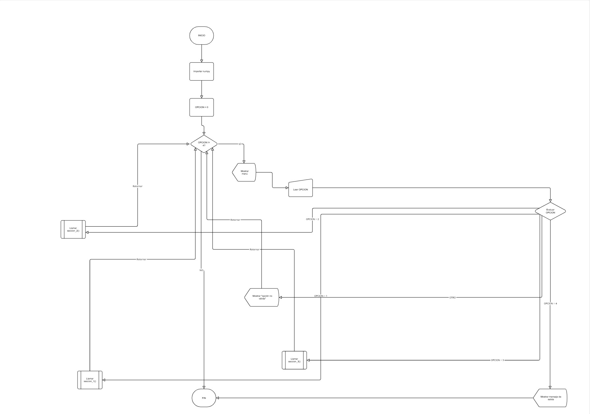

# Proyecto: Tienda Aurelion  

---

## 1. Introducción

El presente análisis se basa en un conjunto de datos proporcionado por **Tienda Aurelion**, una empresa de retail dedicada a la comercialización de productos de consumo masivo en distintas localidades de la provincia de Córdoba, Argentina.  
La organización cuenta con una **cartera de clientes activos**, una **amplia variedad de productos** y un **historial de transacciones** que reflejan el comportamiento de compra durante el año 2024.

---

### Contexto empresarial

Tienda Aurelion ha experimentado un **crecimiento sostenido en la cantidad de clientes y ventas**, lo que demuestra una expansión significativa en el mercado regional.  
Sin embargo, la dirección comercial ha detectado **inconsistencias en la rentabilidad de ciertos productos** y **variaciones en los volúmenes de venta según la ciudad y la categoría de producto**.

El objetivo estratégico de la empresa es comprender **qué productos impulsan el mayor volumen de ventas**, **qué medios de pago son los más utilizados**, y **cómo varía el comportamiento de compra según la ubicación geográfica y el tipo de cliente**.

---

### Problema identificado

El problema principal radica en la **falta de integración analítica entre las distintas fuentes de datos**.  
Aunque Tienda Aurelion registra todas las operaciones comerciales en diferentes sistemas, no cuenta con un **análisis consolidado** que permita responder preguntas clave como:

- ¿Cuáles son los productos más vendidos y en qué ciudades?  
- ¿Qué medios de pago son los más utilizados por los clientes frecuentes?  
- ¿Existen patrones de comportamiento que permitan optimizar las promociones y el stock?  

Esta carencia de análisis impide a la empresa tomar decisiones informadas respecto a la **gestión de inventario, la segmentación de clientes y la estrategia comercial**.

---

### Propuesta de solución

Se propone **integrar y analizar las cuatro tablas de datos** para obtener una visión completa del negocio.  
El objetivo general es construir un sistema analítico básico que permita:

- Consolidar la información de clientes, ventas y productos.  
- Calcular indicadores de desempeño (ventas totales, ticket promedio, productos más vendidos, etc.).  
- Identificar oportunidades de mejora en la oferta comercial y la fidelización de clientes.

Este análisis servirá como base para el desarrollo futuro de herramientas de **Business Intelligence** y **modelos predictivos de ventas**, fortaleciendo la toma de decisiones basada en datos.

---

## 2. Estructura de los datos y tipos de escala

El conjunto de datos de **Tienda Aurelion** está formado por cuatro tablas relacionadas que reflejan el funcionamiento interno del negocio: clientes, productos, ventas y detalle de ventas.  
Cada tabla cumple un rol específico dentro del proceso comercial.

---
### Descripción por tabla

#### **Tabla Clientes**
Contiene la información de los consumidores, incluyendo su nombre, correo electrónico, ciudad y fecha de alta en el sistema.

**Campos:** (`id_cliente`, `nombre_cliente`, `email`, `ciudad`, `fecha_alta`)

| Campo | Tipo | Escala |
|--------|------|--------|
| id_cliente | int | Nominal |
| nombre_cliente | str | Nominal |
| email | str | Nominal |
| ciudad | str | Nominal |
| fecha_alta | date | Intervalo |

---

#### **Tabla Productos**
Lista detallada de los artículos disponibles, clasificados por categoría y con su respectivo precio unitario.

**Campos:** (`id_producto`, `nombre_producto`, `categoria`, `precio_unitario`)

| Campo | Tipo | Escala |
|--------|------|--------|
| id_producto | int | Nominal |
| nombre_producto | str | Nominal |
| categoria | str | Nominal |
| precio_unitario | float | Razón |

---

#### **Tabla Ventas**
Registra cada operación comercial, identificando al cliente, la fecha de compra y el medio de pago utilizado.

**Campos:** (`id_venta`, `fecha`, `id_cliente`, `medio_pago`)

| Campo | Tipo | Escala |
|--------|------|--------|
| id_venta | int | Nominal |
| fecha | date | Intervalo |
| id_cliente | int | Nominal |
| medio_pago | str | Nominal |

---

#### **Tabla Detalle de ventas**
Muestra el desglose de los productos vendidos en cada transacción, con la cantidad, el precio unitario y el importe total. 

**Campos:** (`id_venta`, `id_producto`, `cantidad`, `importe`)

| Campo | Tipo | Escala |
|--------|------|--------|
| id_venta | int | Nominal |
| id_producto | int | Nominal |
| cantidad | int | Razón |
| importe | float | Razón |

---

### Relaciones Entre Tablas

De nuestro modelo relacional, las llaves primarias (**PK**) y foráneas (**FK**) se estructuran de la siguiente manera:

 **Clientes**  
   - **PK:** `id_cliente`  
   - Sin foráneas (tabla independiente, maestra para *Ventas*).

**Productos**  
   - **PK:** `id_producto`  
   - Sin foráneas (tabla independiente, maestra para *Detalle_Ventas*).

**Ventas**  
   - **PK:** `id_venta`  
   - **FK:** `id_cliente` → referencia a **Clientes(id_cliente)**.

**Detalle_Ventas**  
   - **PK compuesta:** (`id_venta`, `id_producto`)  
     (cada producto vendido dentro de una venta es único en el detalle).  
   - **FK1:** `id_venta` → referencia a **Ventas(id_venta)**  
   - **FK2:** `id_producto` → referencia a **Productos(id_producto)**

La estructura del dataset permite analizar el rendimiento de ventas y el comportamiento de los clientes de Tienda Aurelion desde distintos enfoques:  
- Qué productos son más vendidos.  
- Qué medios de pago se utilizan con mayor frecuencia.  
- Cómo evolucionan las compras según la ciudad o la fecha de alta del cliente.  

---

## 3. Programa 
El programa para **Tienda Aurelion** , se trata de una aplicación sencilla realizada en **Python** (programa.py), cuyo propósito es **mostrar información del proyecto y realizar un análisis básico** de ventas simuladas, utilizando únicamente estructuras de control simples y la librería **NumPy**.

Mediante un **menú interactivo en consola**, el usuario puede navegar entre secciones. Cada opción muestra información o ejecuta un análisis numérico básico.

El **menú interactivo**, consta de tres secciones principales:

1. **Historia, problema y solución:** contextualiza la situación de Tienda Aurelion y el propósito del análisis.  
2. **Estructura de los datos:** muestra las tablas, sus tipos de datos, escalas y relaciones.  
3. **Análisis con NumPy:** realiza cálculos básicos sobre un conjunto simulado de importes de ventas.  

---
### Pasos generales para su desarrollo

1. Crear el archivo `programa.py`.
2. Importar la librería `numpy` para cálculos numéricos.
3. Definir una función `mostrar_menu()` que muestre las opciones disponibles.
4. Definir funciones separadas para cada sección:
   - `seccion_1()` → Historia, problema y solución.  
   - `seccion_2()` → Estructura de datos.  
   - `seccion_3()` → Análisis simple con NumPy.
5. Crear un bucle `while` que repita el menú hasta que el usuario elija **Salir (4)**.
6. Usar condicionales `if / elif / else` para ejecutar la opción seleccionada.
7. Finalizar el programa con un mensaje de despedida.

---
### Pseudocódigo

```text
INICIO
  IMPORTAR numpy

  DEFINIR función mostrar_menu()
    MOSTRAR opciones del menú

  DEFINIR función seccion_1()
    IMPRIMIR historia, problema y solución

  DEFINIR función seccion_2()
    IMPRIMIR estructura de los datos y escalas

  DEFINIR función seccion_3()
    CREAR arreglo importes
    CALCULAR total = suma(importes)
    CALCULAR promedio = media(importes)
    MOSTRAR resultados
    SI promedio > 3000 ENTONCES
       MOSTRAR "Promedio de precios alto"
    SINO
       MOSTRAR "Promedio bajo"
    FIN SI
    SI total > 20000 ENTONCES
       MOSTRAR "Buen nivel de ventas"
    SINO
       MOSTRAR "Ventas moderadas"
    FIN SI

  OPCION ← 0
  MIENTRAS OPCION ≠ 4 HACER
    mostrar_menu()
    LEER OPCION
    SEGÚN OPCION HACER
       CASO 1: seccion_1()
       CASO 2: seccion_2()
       CASO 3: seccion_3()
       CASO 4: MOSTRAR mensaje de salida
       OTRO: MOSTRAR "opción no válida"
    FIN SEGÚN
  FIN MIENTRAS
FIN     
```
---
### Diagrama del programa
